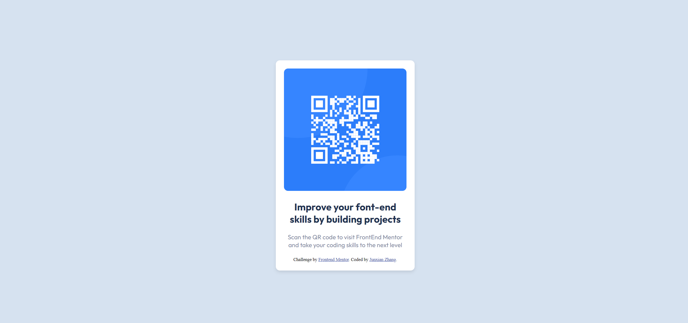

# Frontend Mentor - QR code component solution

This is a solution to the [QR code component challenge on Frontend Mentor](https://www.frontendmentor.io/challenges/qr-code-component-iux_sIO_H). Frontend Mentor challenges help you improve your coding skills by building realistic projects. 

## Table of contents

- [Overview](#overview)
  - [Screenshot](#screenshot)
  - [Links](#links)
- [My process](#my-process)
  - [Built with](#built-with)
  - [What I learned](#what-i-learned)
- [Author](#author)

**Note: Delete this note and update the table of contents based on what sections you keep.**

## Overview

### Screenshot

### Links

- Solution URL: [Github](https://github.com/junxianazhang/QR-code-component)
- Live Site URL: [Vercel](https://qr-code-component-kohl-ten.vercel.app/)

## My process

### Built with

- Semantic HTML5 markup
- CSS custom properties
- Flexbox
- Mobile-first workflow

### What I learned

I learned how to use flexbox and CSS custom properties. I also learned about how to use a meta element to adapt to mobile screens.

## Author

- Website - [Junxian Zhang](https://github.com/junxianazhang)
- Frontend Mentor - [@junxianazhang](https://www.frontendmentor.io/profile/junxianazhang)
